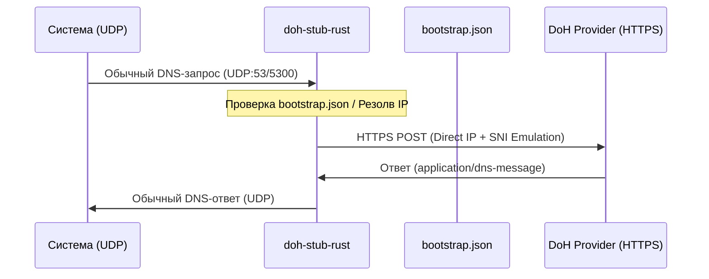

# doh-stub

[](https://github.com/ImSavsis/doh-stub/actions/workflows/ci.yml)
[](https://github.com/ImSavsis/doh-stub/blob/master/LICENSE)

Кроссплатформенный локальный DNS-over-HTTPS (DoH) резолвер на Rust. Преобразует обычные локальные UDP DNS-запросы в шифрованные HTTPS POST-запросы к DoH-провайдеру.

Умеет ходить на DoH-серверы напрямую по IP в обход системного DNS, сохранять найденные провайдеры в локальный JSON-конфиг.



## Особенности

- **Прямое подставление IP (resolve)** — Не зависит от системного DNS для поиска IP-адреса самого DoH-сервера.
- **Bootstrap-резолвер** — Вручную собирает raw DNS-пакеты и парсит A-записи для первичного резолва незнакомых DoH-доменов.
- **Автокэширование (bootstrap.json)** — При передаче нового DoH URL автоматически определяет его IP и сохраняет в конфиг для мгновенного старта в будущем.
- **Эмуляция браузерного TLS Handshake** — Использует wreq с эмуляцией TLS-профиля Firefox 136 для обхода блокировок.

## Сборка

```bash
cargo build --release
```

## Использование

Запуск с параметрами по умолчанию (порт 5300, провайдер Cloudflare):

```bash
./target/release/doh-stub-rust
```

Запуск с кастомным портом и произвольным DoH-провайдером (например, Cloudflare Worker или Google):

```bash
./target/release/doh-stub-rust -p 5300 -d https://your-worker.workers.dev/dns-query
```

### Флаги CLI

- `-p` — Локальный UDP-порт для приема DNS-запросов (по умолчанию: 5300).
- `-d` — URL DoH-провайдера (по умолчанию: `https://cloudflare-dns.com/dns-query`).

## Конфигурация (bootstrap.json)

При первом запуске создается файл `bootstrap.json` с предустановленными провайдерами:

```json
{
  "primary": "dns",
  "providers": [
    {
      "name": "cloudflare-dns",
      "domain": "cloudflare-dns.com",
      "url": "https://cloudflare-dns.com/dns-query",
      "ips": ["104.16.249.249", "104.16.248.249"]
    },
    {
      "name": "google-dns",
      "domain": "dns.google",
      "url": "https://dns.google/dns-query",
      "ips": ["8.8.8.8", "8.8.4.4"]
    }
  ]
}
```

Все новые DoH-URL, переданные через флаг `-d`, автоматически подтягиваются, резолвятся и дописываются в этот файл.

## Системная интеграция (NixOS / systemd)

Чтобы перехватывать весь системный трафик, заблокируйте 53 порт под себя и пропишите `127.0.0.1` в сетевых настройках.

Пример юнита в NixOS:

```nix
systemd.services.doh-stub = {
  description = "Custom Rust DoH Resolver";
  after = [ "network.target" ];
  wantedBy = [ "multi-user.target" ];
  serviceConfig = {
    ExecStart = "/path/to/doh-stub-rust -p 53 -d https://your-doh-provider.com/dns-query";
    WorkingDirectory = "/path/to/doh-dir";
    Restart = "always";
    RestartSec = "3s";
    User = "root";
  };
};
```
