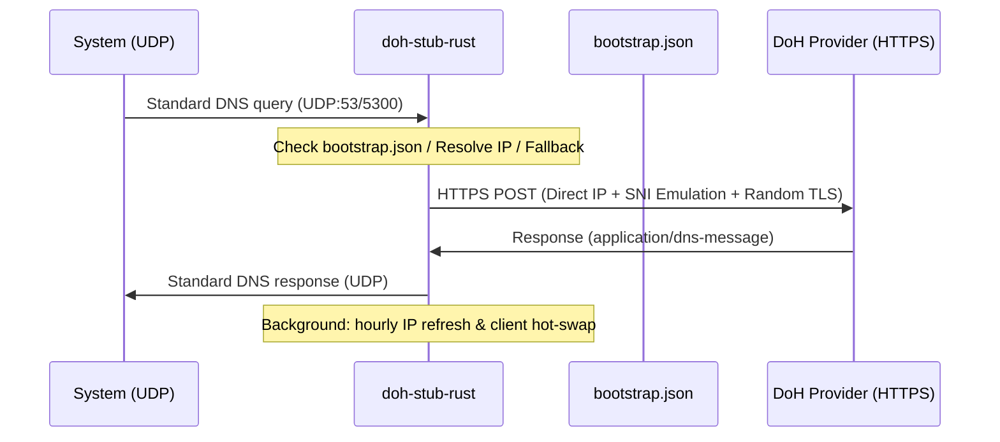

# doh-stub

**[Читать на русском →](./README.ru.md)**

[](https://github.com/ImSavsis/doh-stub/actions/workflows/ci.yml)
[](https://github.com/ImSavsis/doh-stub/blob/master/LICENSE)

Cross-platform local DNS-over-HTTPS (DoH) resolver written in Rust. Converts standard local UDP DNS queries into encrypted HTTPS POST requests to a DoH provider.

Connects directly to DoH servers by IP, bypassing system DNS. Discovers and caches new providers in a local JSON config.



## Features

- **Direct IP connection** — Does not depend on system DNS to resolve the DoH server itself.
- **Automatic provider discovery** — Detects whether the `--doh` argument is an IP or a domain, resolves it via bootstrap providers, and validates the URL.
- **Provider fallback** — If the primary provider fails (timeout, connection error, HTTP error), automatically retries with the next provider from `bootstrap.json`.
- **Bootstrap caching (`bootstrap.json`)** — New DoH URLs passed via `-d` are automatically resolved and appended to the config for instant startup next time.
- **Browser TLS emulation** — Uses `wreq` with Firefox 136 TLS fingerprint to bypass DPI and blocking.
- **Random TLS fingerprints** — Randomizes TLS Client Hello fingerprints (`Emulation::random()`) on every connection to evade DPI and censorship detection.
- **Background IP auto-updater** — A background Tokio task automatically resolves and updates the DoH provider's IP address every hour.
- **Transparent client hot-swap** — Replaces the underlying `wreq` HTTP client transparently when IPs change, without dropping active queries or connections.
- **Request timeouts** — 10s total timeout, 5s connect timeout, 8s per-request timeout to prevent hanging on dead connections.

## Build

```bash
cargo build --release
```

## Usage

Default settings (port 5300, Cloudflare primary with Google fallback):

```bash
./target/release/doh-stub-rust
```

Custom port and provider:

```bash
./target/release/doh-stub-rust -p 53 -d https://dns.google/dns-query
```

Using a direct IP (no domain resolution needed):

```bash
./target/release/doh-stub-rust -p 53 -d https://1.1.1.1/dns-query
```

### CLI Flags

| Flag | Description | Default |
|------|-------------|---------|
| `-p` | Local UDP port for incoming DNS queries | `5300` |
| `-d` | DoH provider URL | `https://cloudflare-dns.com/dns-query` |

## Provider Validation

When a new provider is passed via `-d`, the stub validates it before use:

- **Scheme** must be `https` — `http` is rejected.
- **Path** must contain `dns-query` — standard DoH endpoint required.
- **Host** is automatically detected as either an IP or a domain. Domains are resolved via existing bootstrap providers.

## Fallback Behavior

Providers are tried in order until one succeeds:

1. The provider from `-d` (if it exists in `bootstrap.json`, it is moved to first position).
2. Remaining providers from `bootstrap.json` in their stored order.

If a provider fails, the error is logged and the next one is attempted immediately. If all providers fail, the query is dropped with a fatal log entry.

## Anti-Censorship & DPI Evasion

To resist deep-packet inspection and blocking, `doh-stub` employs multiple layers:

1. **Random TLS fingerprints** — Every HTTPS connection uses a randomized TLS Client Hello fingerprint (`Emulation::random()`), making it harder for DPI systems to fingerprint or block the stub based on static TLS signatures.
2. **Browser SNI emulation** — The TLS handshake mimics a real browser (Firefox 136), blending into normal HTTPS traffic.
3. **Direct IP connection** — Bypasses system DNS entirely, preventing local DNS-based blocking from affecting the DoH path.

## Configuration (`bootstrap.json`)

Created automatically on first run:

```json
{
  "primary": "cloudflare",
  "providers": [
    {
      "name": "cloudflare-dns",
      "domain": "cloudflare-dns.com",
      "url": "https://cloudflare-dns.com/dns-query",
      "ips": ["104.16.249.249", "104.16.248.249"]
    },
    {
      "name": "google-dns",
      "domain": "dns.google",
      "url": "https://dns.google/dns-query",
      "ips": ["8.8.8.8", "8.8.4.4"]
    }
  ]
}
```

New providers discovered via `-d` are appended to this file automatically.

## System Integration (NixOS / systemd)

To intercept all system DNS traffic, bind to port 53 and set `127.0.0.1` as the system resolver.

Example NixOS service:

```nix
systemd.services.doh-stub = {
  description = "Custom Rust DoH Resolver";
  after = [ "network.target" ];
  wantedBy = [ "multi-user.target" ];
  serviceConfig = {
    ExecStart = "/path/to/doh-stub-rust -p 53 -d https://your-doh-provider.com/dns-query";
    WorkingDirectory = "/path/to/doh-dir";
    Restart = "always";
    RestartSec = "3s";
    User = "root";
  };
};
```

## License

MIT
