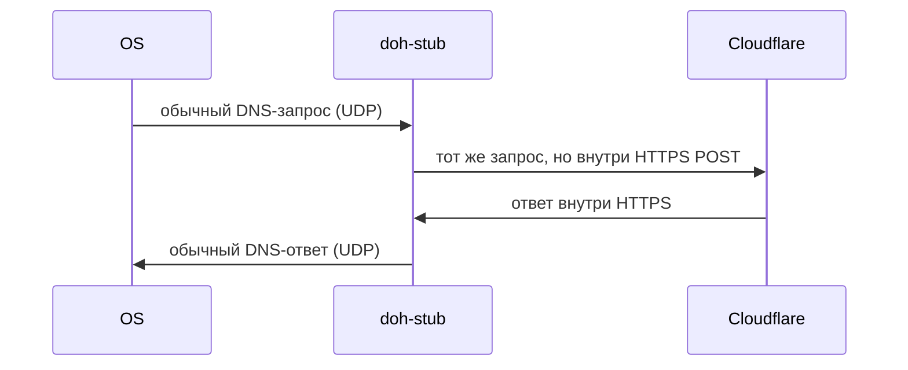

# doh-stub

[](https://github.com/ImSavsis/doh-stub/actions/workflows/ci.yml)
[](https://github.com/ImSavsis/doh-stub/blob/master/LICENSE)

локальный DNS-резолвер на rust, который сам ходит наружу по DNS-over-HTTPS. провайдер/DPI видит только HTTPS к cloudflare, а не голые DNS-запросы.



## сборка

```
cargo build --release
```

## юзать

```
doh-stub-rust\target/release/doh-stub-rust -p 5300 -d https://cloudflare-dns.com/dns-query
```

по умолчанию слушает `127.0.0.1:5300` и форвардит на `cloudflare-dns.com`. чтобы реально подменить системный DNS — нужен порт 53 и админ, плюс прописать `127.0.0.1` в настройках сети.

