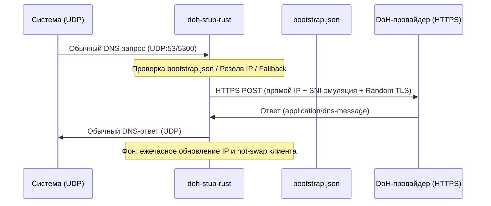

# doh-stub

**[Read in English →](./README.md)**

[](https://github.com/ImSavsis/doh-stub/actions/workflows/ci.yml)
[](https://github.com/ImSavsis/doh-stub/blob/master/LICENSE)

Кроссплатформенный локальный DNS-over-HTTPS (DoH) резолвер на Rust. Преобразует обычные локальные UDP DNS-запросы в шифрованные HTTPS POST-запросы к DoH-провайдеру.

Ходит на DoH-серверы напрямую по IP, минуя системный DNS. Автоматически обнаруживает новых провайдеров и кэширует их в локальный JSON-конфиг.



## Возможности

- **Прямое подключение по IP** — Не зависит от системного DNS для резолва самого DoH-сервера.
- **Автообнаружение провайдеров** — Определяет, передан ли `--doh` как IP или домен, резолвит домен через bootstrap-провайдеров и валидирует URL.
- **Fallback между провайдерами** — Если основной провайдер падает (таймаут, ошибка соединения, HTTP-ошибка), автоматически переключается на следующего из `bootstrap.json`.
- **Bootstrap-кэш (`bootstrap.json`)** — Новые DoH-URL через `-d` автоматически резолвятся и дописываются в конфиг для мгновенного старта в следующий раз.
- **Рандомные TLS-отпечатки** — Рандомизирует TLS Client Hello (`Emulation::random()`) на каждом соединении, усложняя DPI-детекцию и блокировку по статическим сигнатурам.
- **Фоновое автообновление IP** — Фоновая задача Tokio автоматически резолвит и обновляет IP-адреса DoH-провайдера каждый час.
- **Прозрачный hot-swap клиента** — Заменяет HTTP-клиент `wreq` на лету при смене IP, не разрывая активные запросы и соединения.
- **Таймауты запросов** — 10с общий таймаут, 5с на TCP+TLS, 8с на один запрос. Не виснет на мёртвых соединениях.
- **Паддинг трафика с учётом HPACK (`-P`)** — Добавляет к запросу паддинг случайными байтами, размер которого рассчитывается с учётом сжатия заголовков HPACK/QPACK (логика портирована из паддинга XHTTP в Xray), чтобы заданный размер реально доезжал до провода, а не съедался компрессией. По умолчанию выключен (`-P 0`), можно задать фиксированный размер (`-P 500`) или диапазон (`-P 100-500`), из которого на каждый запрос выбирается случайное значение.

## Сборка

### Локальная сборка (любая ОС/дистрибутив, кроме NixOS)

```bash
cargo build --release
```

### Сборка под Windows/Android/Статический Linux/NixOS

Если вы используете NixOS, вы можете кросс-компилировать:
#### Windows
```bash
mv flake.windows.nix flake.nix

nix develop
cargo xwin build --release --target x86_64-pc-windows-msvc
```

#### Android
```bash
mv flake.android.nix flake.nix

nix develop
cargo build --release --target aarch64-linux-android
```

#### Статический Linux
```bash
mv flake.linux.nix flake.nix

nix develop
cargo build --release --target x86_64-unknown-linux-musl
```

#### NixOS
```bash
mv flake.nixos.nix flake.nix

nix develop
cargo build --release
```

## Использование

По умолчанию (порт 5300, Cloudflare primary, Google fallback):

```bash
./target/release/doh-stub-rust
```

Кастомный порт и провайдер:

```bash
./target/release/doh-stub-rust -p 53 -P 100-500 -d https://dns.google/dns-query
```

Прямой IP (резолв домена не нужен):

```bash
./target/release/doh-stub-rust -p 53 -P 0-10 -d https://1.1.1.1/dns-query
```

### Флаги CLI

| Флаг | Описание | По умолчанию |
|------|----------|--------------|
| `-p` | Локальный UDP-порт для входящих DNS-запросов | `5300` |
| `-d` | URL DoH-провайдера | `https://cloudflare-dns.com/dns-query` |
| `-P` | Размер паддинга: `0` (выключен), фиксированное значение (`500`) или диапазон (`100-500`) | `0` |

## Валидация провайдеров

При передаче нового провайдера через `-d` выполняется проверка:

- **Схема** — только `https`, `http` отклоняется.
- **Путь** — должен содержать `dns-query`, стандартный DoH-эндпоинт.
- **Хост** — автоматически определяется как IP или домен. Домены резолвятся через существующих bootstrap-провайдеров.

## Поведение fallback

Провайдеры перебираются по порядку до первого успеха:

1. Провайдер из `-d` (если есть в `bootstrap.json`, он поднимается на первое место).
2. Остальные провайдеры из `bootstrap.json` в порядке хранения.

Если провайдер падает — ошибка логируется и сразу пробуется следующий. Если все упали — запрос сбрасывается с записью в лог.

## Обход цензуры и DPI

Для противостояния глубокому анализу пакетов и блокировкам `doh-stub` использует несколько уровней защиты:

1. **Рандомные TLS-отпечатки** — Каждое HTTPS-соединение использует случайный TLS Client Hello (`Emulation::random()`), что затрудняет DPI-системам идентификацию и блокировку резолвера по статическим сигнатурам.
2. **Эмуляция браузерного SNI** — Рукопожатие TLS имитирует настоящий браузер, сливаясь с обычным HTTPS-трафиком.
3. **Прямое подключение по IP** — Полностью обходит системный DNS, предотвращая локальную DNS-блокировку на пути к DoH-серверу.
4. **Паддинг с учётом HPACK (`-P`)** — Рандомизирует размер запроса, усложняя анализ трафика по длине пакетов. Наивный паддинг почти полностью съедается сжатием заголовков HPACK/QPACK, поэтому итоговый размер рассчитывается так, чтобы пережить компрессию и остаться близким к заданному уже на проводе.

## Конфигурация (`bootstrap.json`)

Создаётся автоматически при первом запуске:

```json
{
  "primary": "cloudflare",
  "providers": [
    {
      "name": "cloudflare-dns",
      "domain": "cloudflare-dns.com",
      "url": "https://cloudflare-dns.com/dns-query",
      "ips": ["104.16.249.249", "104.16.248.249"]
    },
    {
      "name": "google-dns",
      "domain": "dns.google",
      "url": "https://dns.google/dns-query",
      "ips": ["8.8.8.8", "8.8.4.4"]
    }
  ]
}
```

Новые провайдеры, обнаруженные через `-d`, дописываются в файл автоматически.

## Системная интеграция (NixOS / systemd)

Для перехвата всего системного DNS-трафика забиндись на 53 порт и пропиши `127.0.0.1` как системный резолвер.

Пример сервиса в NixOS:

```nix
systemd.services.doh-stub = {
  description = "Custom Rust DoH Resolver";
  after = [ "network.target" ];
  wantedBy = [ "multi-user.target" ];
  serviceConfig = {
    ExecStart = "/path/to/doh-stub-rust -p 53 -P 100-200 -d https://your-doh-provider.com/dns-query";
    WorkingDirectory = "/path/to/doh-dir";
    Restart = "always";
    RestartSec = "3s";
    User = "root";
  };
};
```

## Лицензия

MIT